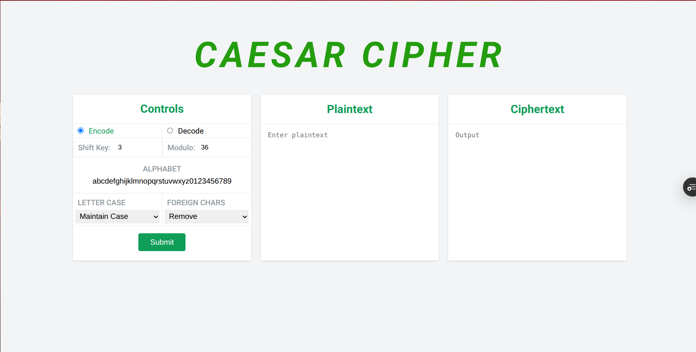

---

# Caesar Cipher Encryption & Decryption (JavaScript)

## Overview

This project is a JavaScript implementation of the **Caesar Cipher**, a classical cryptographic algorithm used to demonstrate basic concepts of substitution ciphers, modular arithmetic, and reversible encryption.

The application provides both **encryption (encoding)** and **decryption (decoding)** capabilities through a clean web-based interface, allowing users to customize parameters such as shift value, alphabet, case handling, and foreign character behavior.



---

## Features

* ✅ Caesar cipher **encryption and decryption**
* ✅ Configurable **shift key**
* ✅ Custom **alphabet support**
* ✅ Proper **modular wrap-around**
* ✅ Encode / decode toggle
* ✅ Case handling options:

  * Maintain case
  * Force lowercase
  * Force uppercase
* ✅ Foreign character handling:

  * Remove unsupported characters
  * Ignore and preserve them
* ✅ Simple, responsive UI built with HTML, CSS, and JavaScript

---

## How the Caesar Cipher Works

The Caesar cipher shifts each character in the plaintext by a fixed number of positions within a defined alphabet.

### Encryption Formula

```
E(x) = (x + k) mod n
```

### Decryption Formula

```
D(x) = (x - k) mod n
```

Where:

* `x` is the index of a character in the alphabet
* `k` is the shift key
* `n` is the length of the alphabet

This project correctly implements both operations using modular arithmetic.

---

## Project Structure

```
.
├── index.html      # User interface
├── style.css       # Application styling
├── caesar.js       # Cipher logic (encryption & decryption)
└── README.md       # Project documentation
```

---

## Installation & Usage

### 1. Clone the repository

```bash
git clone https://github.com/Chidubemkingsley/Caesarian-Cipher.git
cd Caesarian-Cipher.
```

### 2. Open the application

Open `index.html` in any modern web browser:

```bash
open index.html
```

No additional dependencies or build tools are required.

---

## Usage Instructions

1. Choose **Encode** or **Decode**
2. Enter a **shift key**
3. Define the **alphabet** (default: `abcdefghijklmnopqrstuvwxyz0123456789`)
4. Select case handling and foreign character options
5. Enter text in the input box
6. Click **Submit** to view the result

---

## Implementation Details

* The cipher logic is implemented in a single reusable function.
* Decryption is achieved by reversing the shift direction.
* Modular arithmetic ensures correct wrap-around behavior.
* Input validation and character filtering are applied where necessary.

The implementation follows best practices by avoiding duplicate logic and maintaining clarity and correctness.

---

## Example

**Input**

```
Plaintext: chidubem 
Shift Key: 3
```

**Output**

```
Ciphertext: fklgxehp
```

Decoding the ciphertext with the same shift correctly restores the original message.

---

## Educational Purpose

This project is intended for:

* Learning basic cryptography concepts
* Demonstrating encryption/decryption logic
* Academic or beginner-friendly cryptography assignments
* JavaScript algorithm practice

---

## Author

**Rubeluchukwuisi Chidubem Kingsley**
GitHub: [https://github.com/Chidubemkingsley](https://github.com/Chidubemkingsley/Caesarian-Cipher.git)

---

## License

This project is provided for educational purposes and is free to use, modify, and distribute.

---


